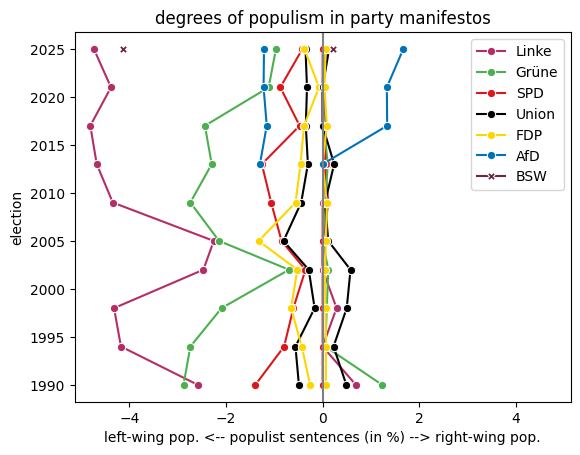
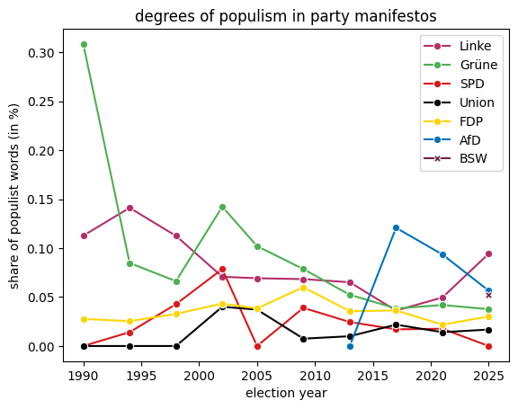
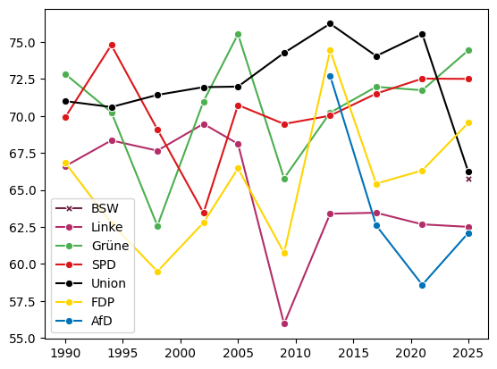

# New Lingo in Politics? Using NLP to Study NLP

_This project analyzes German party manifestos (1990–2025) using natural language processing to examine whether political rhetoric has become more populist over time. It compares three generations of computational text analysis methods: 1) bag-of-words dictionaries, 2) regex-based dictionaries, and 3) transformer-based language models._

## Key Findings

- **Manifesto rhetoric matches party profiles**: NLP classifications align with parties' known ideological positioning, both in orientation (left-wing populism for Linke/BSW vs. right-wing populism for AfD) and in magnitude (populist scores are consistently higher for radical/fringe parties than for centrist/mainstream ones like Union, SPD, FDP, Grüne).
- **Transformer models trained on political speech perform well**: PopBERT, fine-tuned on parliamentary speeches, produces credible sentence-level classifications and is treated as the most reliable evidence in this analysis, since it captures context rather than relying on isolated word or pattern matches.
- **Dictionary-based methods are noisy**: the bag-of-words and regex-dictionary approaches suffer from limited vocabulary coverage, missed negations (e.g. "weder... noch..."), and false positives (e.g. "herrschend" flagged as populist), making their trend estimates less trustworthy.

## Motivation

Political language is widely reported to be shifting toward more polarized, emotional, and populist registers — in social media discourse and in parliamentary debate. Whether this shift has also permeated party manifestos, the more formal and deliberately drafted documents parties produce for elections, is far less clear. This project addresses that open question directly: **Has populism increased in German party manifestos since German reunification?** In addition, the project also considers changes in structural language complexity as well as their normative implications.

## Data

- **Source**: [Manifesto Project](https://manifesto-project.wzb.eu/), which collects party manifestos globally and provides pre-cleaned raw text (crowd-coded into quasi-sentences), unlike PDF-only alternatives from parties or the Bundes-/Landeszentralen für politische Bildung.
- **Coverage**: party manifestos for German federal elections ("Bundestagswahlen") since reunification (1990–2025), covering all major parties, comprising 55 manifestos and ~100,000 sentences in total.
- **Acquisition**: manifesto texts and metadata are retrieved via the Manifesto Project API (requires a free API key), with versioned core and metadata datasets queried to locate and download each party-election manifesto.
- **Preprocessing**:
  - Umlaut re-encoding: correcting inconsistent encodings of German umlauts (ä/ö/ü) present in some manifestos.
  - Sentencizing: applying spaCy sentence segmentation to older manifestos (1990, 1994) that were not pre-split into quasi-sentences.
  - Pseudo-sentence removal: filtering out non-sentence artifacts (e.g. index entries) that would otherwise distort sentence-level scoring.
  - Lemmatization and document-term matrix (DTM) construction via spaCy, used for the word-level (bag-of-words) analysis.

## Methodology: Three Generations of Text Analysis

The notebook deliberately walks through the historical progression of computational text analysis, applying each generation of method to the same question and data, and using the shortcomings of each approach to motivate the next. For each generation, a variety of tools within that category is applied; the example discussed and plotted below is a representative sample rather than the sole tool used.

### 1) Bag-of-words dictionary matching

Each manifesto is reduced to a document-term matrix (a "bag of words") of lemmatized word counts. Populism is then measured as the share of words matching a predefined dictionary. As a representative example, we use [Pauwels (2017)](https://www.nomos-elibrary.de/de/10.5771/9783845271491-123/chapter-6-measuring-populism-a-review-of-current-approaches?page=1), whose dictionary includes stems like `Gier*`, `Grosskonzern*`, and `herrschend*`. Other bag-of-words dictionaries applied in the notebook include [Rooduijn & Pauwels (2011)](https://www.tandfonline.com/doi/full/10.1080/01402382.2011.616665#d1e164) for populism, and general-purpose sentiment/polarity dictionaries such as [SentiWS](https://wortschatz.uni-leipzig.de/en/download), [BAWL-R](https://osf.io/hx6r8/), [GermanPolarityCues (GPC)](https://www.ulliwaltinger.de/sentiment-analysis-reloaded-a-comparative-study-on-sentiment-polarity-identification-combining-machine-learning-and-subjectivity-features/), [Rauh (2018)](https://www.tandfonline.com/doi/full/10.1080/19331681.2018.1485608), and [Haselmeyer & Jenny (2017)](https://link.springer.com/article/10.1007/s11135-016-0412-4).

The plot shows the share of populist words (by this dictionary) per manifesto over time and by party. **Limitations**: the dictionary is a limited, fixed list; the word-level approach misses negations (e.g. "weder... noch..." inverts meaning without removing the flagged word); and it generates false positives, since some listed stems (e.g. "herrschend") occur in non-populist contexts. These issues limit how much can be read into the trends shown above.

### 2) Regex + dictionary matching

This approach moves from single-word matching to more complex multi-word regex patterns, and classifies at the sentence level rather than the word level. As a representative example, we use [Gründl (2020)](https://journals.sagepub.com/doi/10.1177/1461444820976970), whose dictionary includes patterns such as `'(a|ä)ngst(e)?(de(s|r)|eine(s|r)|unsere(s|r))deutsche(n|r)'`. Gründl's dictionary is applied in both a reduced and a full-pattern version within the notebook.

The plot shows the share of populist sentences (by this dictionary) per manifesto over time and by party. **Limitations**: both over- and under-identification. 1) Over-identification/false positives: classifying over 50–80% of sentences in a manifesto as "populist" seems incredible — visible in the consistently high values across the plot. 2) Under-identification/false negatives: pattern matching still cannot fully capture context, e.g. "Angst _vieler_ Deutscher" will not be matched by the pattern above, meaning the plotted shares likely understate true populist content in some cases even as they overstate it in others.

### 3) Transformer-based classification

The final approach uses transformer-based language models fine-tuned for political text classification. As a representative example, we use [PopBERT (2025)](https://huggingface.co/luerhard/PopBERT), built on GBERT-Large and fine-tuned on annotated parliamentary speeches. Rather than matching fixed rules, it produces sentence-level probabilities (multi-label approach) for four types of populism: 1) Anti-elitism, 2) People-centrism, 3) Left-wing host-ideology, 4) Right-wing host-ideology. We focus on the last two, i.e. distinguishing between left-wing (socialist) and right-wing (nativist) populism. Other transformer models applied in the notebook include [german-sentiment-bert](https://huggingface.co/oliverguhr/german-sentiment-bert), [german-party-sentiment-bert](https://huggingface.co/Commandante/german-party-sentiment-bert), and [XLM-RoBERTa-German-Sentiment](https://huggingface.co/ssary/XLM-RoBERTa-German-sentiment).

The plot shows, for each party and election year, the share of sentences classified as left-wing vs. right-wing populist. **Limitations**: the model is pre-trained on oral speeches rather than written manifestos. Nevertheless, its predictions closely resemble parties' ideological positioning, as visible in the plot (see [Results](#results-in-detail)).

## Results in Detail

The bag-of-words (4.1) and regex-dictionary (4.2) results should be interpreted with caution, given the vocabulary-coverage, negation, and false-positive issues described above; at best, they offer a rough, noisy first pass at the question. The transformer-based results (4.3) are the most informative and reliable output of the analysis: populism scores by dimension track known party profiles (AfD scoring highest on right-wing populism; Linke and BSW scoring highest on left-wing populism), and a rhetorical shift toward greater populism over time is visible for radical/fringe parties but not for centrist/mainstream ones.

## Repository Structure

The notebook (`sandbox.ipynb`) is organized into four main sections, each of which can be run independently using locally cached intermediate data:

1. **Data acquisition**: exploring and querying the Manifesto Project API (requires `manifesto_api_key` in a `.env` file).
2. **Data preparation**: NLP preprocessing pipeline (requires spaCy with a German model, e.g. `de_core_news_lg`).
3. **Data exploration**: descriptive statistics on manifesto structure, sentence length, and nominal style.
4. **Data analysis**: sentiment and populism scoring using word dictionaries (SentiWS, BAWL-R, GPC, Rauh, HaJe, RoPa, Pauwels, Gründl) and transformer-based models (german-sentiment-bert, PopBERT, XLM-RoBERTa-German-Sentiment).

### Dependencies

Key libraries include `spacy`, `transformers`, `torch`, `germansentiment`, `hyperscan`, `pandas`, `seaborn`, `rdata`, and `python-dotenv`. Each major section can be skipped in favor of loading pre-processed local copies (pickled dictionaries of manifesto texts, DTMs, and classification outputs) if the corresponding API key or model installation is unavailable.

## References

- Manifesto Project (WZB). [manifesto-project.wzb.eu](https://manifesto-project.wzb.eu/)
- Pauwels, T. (2017). Measuring Populism: A Review of Current Approaches. In *Political Populism* (Nomos), 123-136.
- Gründl, J. (2020). Populist ideas on social media: A dictionary-based measurement of populist communication. New Media & Society, 24(6), 1481-1499. [doi.org/10.1177/1461444820976970](https://doi.org/10.1177/1461444820976970)
- Erhard, L., Hanke, S., Remer, U., Falenska, A., & Heiberger, R. H. (2025). PopBERT. Detecting Populism and Its Host Ideologies in the German Bundestag. Political Analysis, 33(1), 1–17. [doi:10.1017/pan.2024.12](https://doi:10.1017/pan.2024.12)